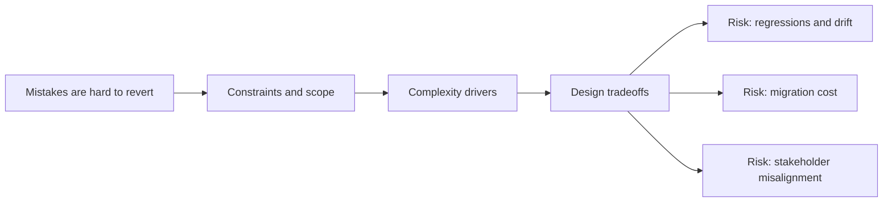

# Mistakes are hard to revert

@Metadata {
  @PageKind(article)
  @PageColor(gray)
  @TitleHeading("Large Mobile Apps")
  @PageImage(purpose: icon, source: "ios-scaling-challenges-02-mistakes-are-hard-to-revert-icon.codex", alt: "Mistakes are hard to revert Icon")
  @PageImage(purpose: card, source: "ios-scaling-challenges-02-mistakes-are-hard-to-revert-card.codex", alt: "Mistakes are hard to revert Card")
}

@Options {
  @AutomaticSeeAlso(disabled)
}

@Image(source: "doc-02-mistakes-are-hard-to-revert-hero.codex", alt: "Mistakes are hard to revert hero")

@Image(source: "ios-scaling-challenges-02-mistakes-are-hard-to-revert-hero.codex", alt: "Mistakes are hard to revert Hero")

App Store review, phased release, and client rollout make hotfixes slow and
rollback paths narrow.

## Why it gets harder at scale

- App Store propagation delays keep broken builds in the wild.
- Server flags cannot undo client regressions that ship in the binary.

## Scale signals

- Incidents require server gating to mask client defects.
- Rollback plans are absent or untested in release playbooks.

## Studio Laussat take

- Ship every change with a rollback story and a kill switch plan.

## Diagram: Context snapshot

@Image(source: "ios-scaling-challenges-02-mistakes-are-hard-to-revert-context.mermaid", alt: "Context snapshot")

