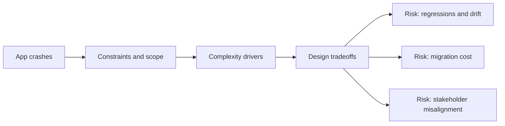

# App crashes

@Metadata {
  @PageKind(article)
  @PageColor(gray)
  @TitleHeading("Large Mobile Apps")
  @PageImage(purpose: icon, source: "ios-scaling-challenges-06-app-crashes-icon.codex", alt: "App crashes Icon")
  @PageImage(purpose: card, source: "ios-scaling-challenges-06-app-crashes-card.codex", alt: "App crashes Card")
}

@Options {
  @AutomaticSeeAlso(disabled)
}

@Image(source: "doc-06-app-crashes-hero.codex", alt: "App crashes hero")

@Image(source: "ios-scaling-challenges-06-app-crashes-hero.codex", alt: "App crashes Hero")

Crashes at scale are often OOMs, watchdog kills, or edge-case lifecycle races.

## Why it gets harder at scale

- Symbolication and dSYM hygiene are easy to break across releases.
- Crash signatures vary by OS, device, and feature flag states.

## Scale signals

- Crash-free sessions drop after phased rollout begins.
- OOM and watchdog terminations cluster on older devices.

## Studio Laussat take

- Treat crash-free rate as a budget with strict alerting.

## Diagram: Context snapshot

@Image(source: "ios-scaling-challenges-06-app-crashes-context.mermaid", alt: "Context snapshot")

