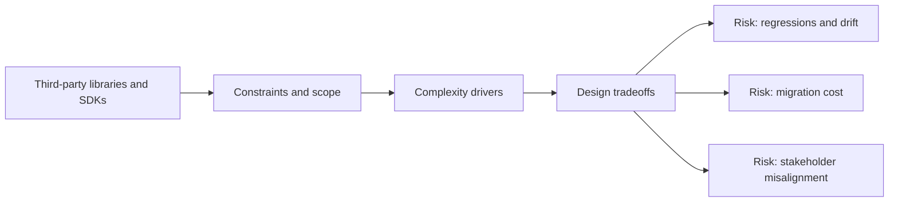

# Third-party libraries and SDKs

@Metadata {
  @PageKind(article)
  @PageColor(gray)
  @TitleHeading("Large Mobile Apps")
  @PageImage(purpose: icon, source: "ios-scaling-challenges-10-third-party-libraries-and-sdks-icon.codex", alt: "Third-party libraries and SDKs Icon")
  @PageImage(purpose: card, source: "ios-scaling-challenges-10-third-party-libraries-and-sdks-card.codex", alt: "Third-party libraries and SDKs Card")
}

@Options {
  @AutomaticSeeAlso(disabled)
}

@Image(source: "doc-10-third-party-libraries-and-sdks-hero.codex", alt: "Third party libraries and SDKs hero")

@Image(source: "ios-scaling-challenges-10-third-party-libraries-and-sdks-hero.codex", alt: "Third-party libraries and SDKs Hero")

SDK sprawl affects startup time, privacy posture, and update cadence.

## Why it gets harder at scale

- Binary frameworks hide behavior and can introduce swizzling risks.
- Vendor release cycles rarely align with App Store schedules.

## Scale signals

- App startup time grows with each new SDK.
- Privacy manifests and data flows drift out of compliance.

## Studio Laussat take

- Wrap third-party SDKs behind internal adapters and version them.

## Diagram: Context snapshot

@Image(source: "ios-scaling-challenges-10-third-party-libraries-and-sdks-context.mermaid", alt: "Context snapshot")

