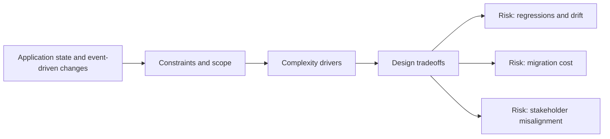

# Application state and event-driven changes

@Metadata {
  @PageKind(article)
  @PageColor(gray)
  @TitleHeading("Large Mobile Apps")
  @PageImage(purpose: icon, source: "ios-scaling-challenges-14-application-state-and-event-driven-changes-icon.codex", alt: "Application state and event-driven changes Icon")
  @PageImage(purpose: card, source: "ios-scaling-challenges-14-application-state-and-event-driven-changes-card.codex", alt: "Application state and event-driven changes Card")
}

@Options {
  @AutomaticSeeAlso(disabled)
}

@Image(source: "doc-14-application-state-and-event-driven-changes-hero.codex", alt: "Application state and event driven changes hero")

@Image(source: "ios-scaling-challenges-14-application-state-and-event-driven-changes-hero.codex", alt: "Application state and event-driven changes Hero")

App lifecycle events, push notifications, and auth refreshes collide at scale.

## Why it gets harder at scale

- Multiple event sources trigger the same behaviors.
- Background and foreground transitions interrupt in-flight work.

## Scale signals

- Duplicate handlers trigger repeated UI updates.
- Hard-to-reproduce state races after interruptions.

## Studio Laussat take

- Centralize event handling with throttling and clear priorities.

## Diagram: Context snapshot

@Image(source: "ios-scaling-challenges-14-application-state-and-event-driven-changes-context.mermaid", alt: "Context snapshot")

