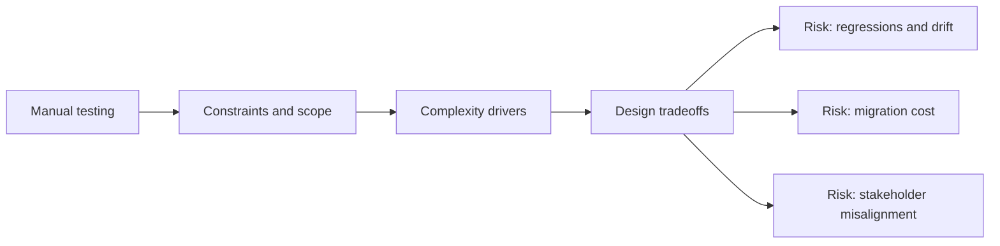

# Manual testing

@Metadata {
  @PageKind(article)
  @PageColor(gray)
  @TitleHeading("Large Mobile Apps")
  @PageImage(purpose: icon, source: "ios-scaling-challenges-18-manual-testing-icon.codex", alt: "Manual testing Icon")
  @PageImage(purpose: card, source: "ios-scaling-challenges-18-manual-testing-card.codex", alt: "Manual testing Card")
}

@Options {
  @AutomaticSeeAlso(disabled)
}

@Image(source: "doc-18-manual-testing-hero.codex", alt: "Manual testing hero")

@Image(source: "ios-scaling-challenges-18-manual-testing-hero.codex", alt: "Manual testing Hero")

Manual testing is still essential for device-specific and accessibility checks.

## Why it gets harder at scale

- Device matrices expand faster than test capacity.
- Accessibility and low-memory scenarios need real hardware.

## Scale signals

- Late-cycle regressions appear after TestFlight rollout.
- Teams skip exploratory sessions under release pressure.

## Studio Laussat take

- Define TestFlight RC playbooks and device coverage requirements.

## Diagram: Context snapshot

@Image(source: "ios-scaling-challenges-18-manual-testing-context.mermaid", alt: "Context snapshot")

