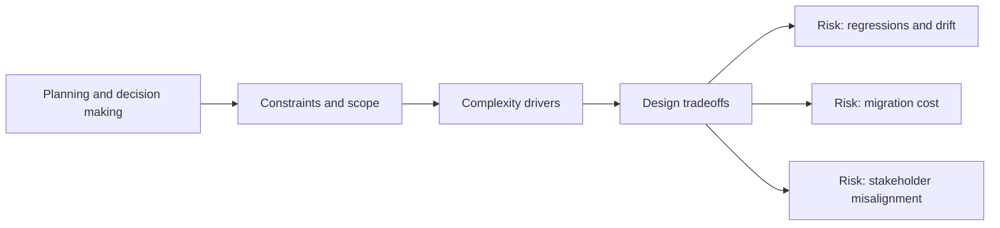

# Planning and decision making

@Metadata {
  @PageKind(article)
  @PageColor(gray)
  @TitleHeading("Large Mobile Apps")
  @PageImage(purpose: icon, source: "ios-scaling-challenges-19-planning-and-decision-making-icon.codex", alt: "Planning and decision making Icon")
  @PageImage(purpose: card, source: "ios-scaling-challenges-19-planning-and-decision-making-card.codex", alt: "Planning and decision making Card")
}

@Options {
  @AutomaticSeeAlso(disabled)
}

@Image(source: "doc-19-planning-and-decision-making-hero.codex", alt: "Planning and decision making hero")

@Image(source: "ios-scaling-challenges-19-planning-and-decision-making-hero.codex", alt: "Planning and decision making Hero")

Planning must account for App Store latency, platform changes, and deprecations.

## Why it gets harder at scale

- Platform changes can invalidate plans late in the cycle.
- API removals require migration windows for multiple releases.

## Scale signals

- No clear deprecation plans or migration guides.
- Release calendars drift due to late scope changes.

## Studio Laussat take

- Use RFCs with explicit rollback and migration timelines.

## Diagram: Context snapshot

@Image(source: "ios-scaling-challenges-19-planning-and-decision-making-context.mermaid", alt: "Context snapshot")

