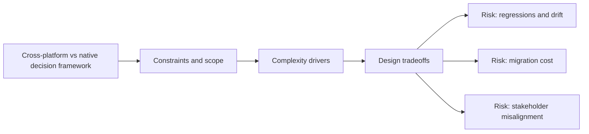

# Cross-platform vs native decision framework

@Metadata {
  @PageKind(article)
  @PageColor(gray)
  @TitleHeading("Large Mobile Apps")
  @PageImage(purpose: icon, source: "ios-scaling-challenges-28-cross-platform-vs-native-decision-framework-icon.codex", alt: "Cross-platform vs native decision framework Icon")
  @PageImage(purpose: card, source: "ios-scaling-challenges-28-cross-platform-vs-native-decision-framework-card.codex", alt: "Cross-platform vs native decision framework Card")
}

@Options {
  @AutomaticSeeAlso(disabled)
}

@Image(source: "doc-28-cross-platform-vs-native-decision-framework-hero.codex", alt: "Cross platform vs native decision framework hero")

@Image(source: "ios-scaling-challenges-28-cross-platform-vs-native-decision-framework-hero.codex", alt: "Cross-platform vs native decision framework Hero")

Choosing React Native, WebView, or native has long-term product implications.

## Why it gets harder at scale

- Shared stacks can slow platform-specific performance tuning.
- Debugging toolchains multiply when stacks diverge.

## Scale signals

- Performance regressions persist due to stack limitations.
- Feature delivery slows as teams negotiate ownership.

## Studio Laussat take

- Use a decision rubric that weighs performance, UX, and maintenance cost.

## Diagram: Context snapshot

@Image(source: "ios-scaling-challenges-28-cross-platform-vs-native-decision-framework-context.mermaid", alt: "Context snapshot")

