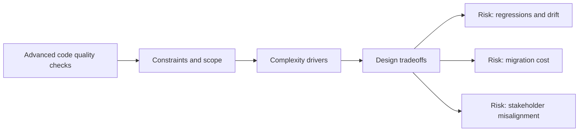

# Advanced code quality checks

@Metadata {
  @PageKind(article)
  @PageColor(gray)
  @TitleHeading("Large Mobile Apps")
  @PageImage(purpose: icon, source: "ios-scaling-challenges-35-advanced-code-quality-checks-icon.codex", alt: "Advanced code quality checks Icon")
  @PageImage(purpose: card, source: "ios-scaling-challenges-35-advanced-code-quality-checks-card.codex", alt: "Advanced code quality checks Card")
}

@Options {
  @AutomaticSeeAlso(disabled)
}

@Image(source: "doc-35-advanced-code-quality-checks-hero.codex", alt: "Advanced code quality checks hero")

@Image(source: "ios-scaling-challenges-35-advanced-code-quality-checks-hero.codex", alt: "Advanced code quality checks Hero")

Static analysis, sanitizers, and API break checks guard long-term quality.

## Why it gets harder at scale

- Quality checks add time unless automated and budgeted.
- Inconsistent enforcement leads to uneven standards.

## Scale signals

- Warnings are ignored or waived without review.
- Security and concurrency issues surface late.

## Studio Laussat take

- Enforce quality gates in CI with clear escape hatches.

## Diagram: Context snapshot

@Image(source: "ios-scaling-challenges-35-advanced-code-quality-checks-context.mermaid", alt: "Context snapshot")

