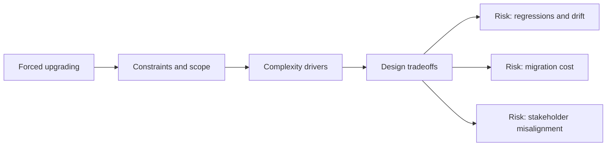

# Forced upgrading

@Metadata {
  @PageKind(article)
  @PageColor(gray)
  @TitleHeading("Large Mobile Apps")
  @PageImage(purpose: icon, source: "ios-scaling-challenges-38-forced-upgrading-icon.codex", alt: "Forced upgrading Icon")
  @PageImage(purpose: card, source: "ios-scaling-challenges-38-forced-upgrading-card.codex", alt: "Forced upgrading Card")
}

@Options {
  @AutomaticSeeAlso(disabled)
}

@Image(source: "doc-38-forced-upgrading-hero.codex", alt: "Forced upgrading hero")

@Image(source: "ios-scaling-challenges-38-forced-upgrading-hero.codex", alt: "Forced upgrading Hero")

Minimum OS or app version enforcement must balance safety and user trust.

## Why it gets harder at scale

- Users can stay on old versions for months.
- Backend compatibility windows complicate enforcement.

## Scale signals

- Sudden drops in active users after version gates.
- Support tickets spike after forced updates.

## Studio Laussat take

- Phase enforcement with warnings and clear communication.

## Diagram: Context snapshot

@Image(source: "ios-scaling-challenges-38-forced-upgrading-context.mermaid", alt: "Context snapshot")

