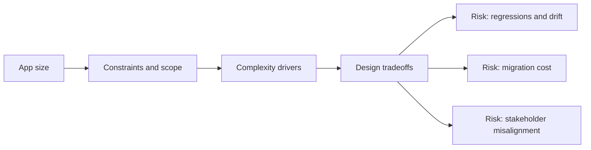

# App size

@Metadata {
  @PageKind(article)
  @PageColor(gray)
  @TitleHeading("Large Mobile Apps")
  @PageImage(purpose: icon, source: "ios-scaling-challenges-39-app-size-icon.codex", alt: "App size Icon")
  @PageImage(purpose: card, source: "ios-scaling-challenges-39-app-size-card.codex", alt: "App size Card")
}

@Options {
  @AutomaticSeeAlso(disabled)
}

@Image(source: "doc-39-app-size-hero.codex", alt: "App size hero")

@Image(source: "ios-scaling-challenges-39-app-size-hero.codex", alt: "App size Hero")

Binary size grows with assets, duplicate frameworks, and unused code paths.

## Why it gets harder at scale

- Asset catalogs and bundles expand faster than cleanup.
- Static linking and generics can bloat binaries.

## Scale signals

- App size increases every release without explanation.
- Downloads drop in low-bandwidth regions.

## Studio Laussat take

- Audit size budgets and use on-demand resources.

## Diagram: Context snapshot

@Image(source: "ios-scaling-challenges-39-app-size-context.mermaid", alt: "Context snapshot")

