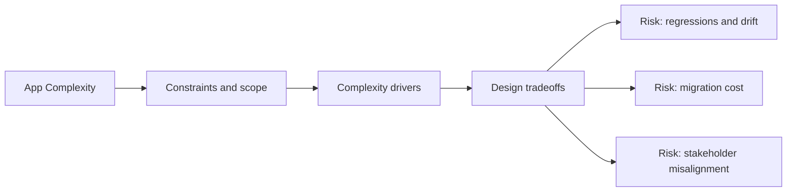

# App Complexity

@Metadata {
  @PageKind(article)
  @PageColor(gray)
  @TitleHeading("App Complexity")
  @PageImage(purpose: icon, source: "ios-scaling-challenges-part-2-app-complexity-icon.codex", alt: "App complexity icon")
  @PageImage(purpose: card, source: "ios-scaling-challenges-part-2-app-complexity-card.codex", alt: "App complexity card")
}

@Options {
  @TopicsVisualStyle(detailedGrid)
  @AutomaticSeeAlso(disabled)
}

@Image(source: "doc-part-2-app-complexity-hero.codex", alt: "App Complexity hero")

@Image(source: "ios-scaling-challenges-part-2-app-complexity-hero.codex", alt: "App complexity hero")

As apps grow, navigation, localization, and testing become systems problems.

## Topics

- <doc:13-navigation-architecture>
- <doc:14-application-state-and-event-driven-changes>
- <doc:15-localization>
- <doc:16-modular-architecture-and-dependency-injection>
- <doc:17-automated-testing>
- <doc:18-manual-testing>

## Diagram: Context snapshot

@Image(source: "ios-scaling-challenges-part-2-app-complexity-context.mermaid", alt: "Context snapshot")

