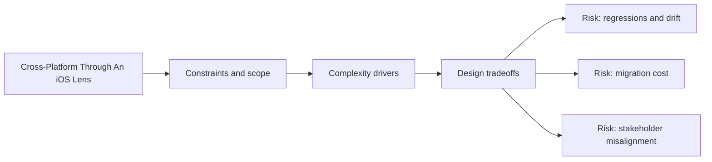

# Cross-Platform Through An iOS Lens

@Metadata {
  @PageKind(article)
  @PageColor(gray)
  @TitleHeading("Cross-Platform Through An iOS Lens")
  @PageImage(purpose: icon, source: "ios-scaling-challenges-part-4-cross-platform-ios-lens-icon.codex", alt: "Cross-platform iOS lens icon")
  @PageImage(purpose: card, source: "ios-scaling-challenges-part-4-cross-platform-ios-lens-card.codex", alt: "Cross-platform iOS lens card")
}

@Options {
  @TopicsVisualStyle(detailedGrid)
  @AutomaticSeeAlso(disabled)
}

@Image(source: "doc-part-4-cross-platform-ios-lens-hero.codex", alt: "Cross Platform Through An iOS Lens hero")

@Image(source: "ios-scaling-challenges-part-4-cross-platform-ios-lens-hero.codex", alt: "Cross-platform iOS lens hero")

Cross-platform choices still land inside the Apple ecosystem and its tradeoffs.

## Topics

- <doc:25-adopting-new-languages-and-frameworks>
- <doc:26-interop-and-shared-logic-boundaries>
- <doc:27-cross-platform-feature-development>
- <doc:28-cross-platform-vs-native-decision-framework>
- <doc:29-web-pwa-and-server-driven-apps>

## Diagram: Context snapshot

@Image(source: "ios-scaling-challenges-part-4-cross-platform-ios-lens-context.mermaid", alt: "Context snapshot")

