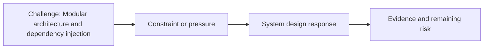

# Modular architecture and dependency injection

@Metadata {
  @PageKind(article)
  @PageColor(gray)
  @PageImage(purpose: icon, source: "system-designs-google-maps-font-system-scaling-challenges-challenge.app-complexity.modular-architecture-and-dependency-injection-icon.codex", alt: "Modular architecture and dependency injection icon")
  @PageImage(purpose: card, source: "system-designs-google-maps-font-system-scaling-challenges-challenge.app-complexity.modular-architecture-and-dependency-injection-card.codex", alt: "Modular architecture and dependency injection card")
}

@Image(source: "system-designs-google-maps-font-system-scaling-challenges-challenge.app-complexity.modular-architecture-and-dependency-injection-hero.codex", alt: "Modular architecture and dependency injection hero")

This page records how the Google Maps typography system addressed "Modular architecture and dependency injection".

## Challenge

We moved away from ad hoc state setting controlled by controllers.

## System design response

We introduced a service-based experiment that loads the right implementation
at runtime.

## Evidence and remaining risk

We removed the chance of state restoration invalidating the experiment.
## Diagram: Context snapshot

@Image(source: "system-designs-google-maps-font-system-scaling-challenges-challenge.app-complexity.modular-architecture-and-dependency-injection-context.mermaid", alt: "Context snapshot")

