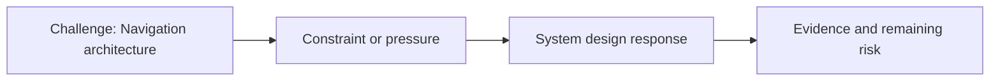

# Navigation architecture

@Metadata {
  @PageKind(article)
  @PageColor(gray)
  @PageImage(purpose: icon, source: "system-designs-google-maps-font-system-scaling-challenges-challenge.app-complexity.navigation-architecture-icon.codex", alt: "Navigation architecture icon")
  @PageImage(purpose: card, source: "system-designs-google-maps-font-system-scaling-challenges-challenge.app-complexity.navigation-architecture-card.codex", alt: "Navigation architecture card")
}

@Image(source: "system-designs-google-maps-font-system-scaling-challenges-challenge.app-complexity.navigation-architecture-hero.codex", alt: "Navigation architecture hero")

This page records how the Google Maps typography system addressed "Navigation architecture".

## Challenge

Google Fonts needed to be used in the main navigation element.

## System design response

N/A.

## Evidence and remaining risk

We timed the milliseconds to load for the main navigation typography.

## Diagram: Context snapshot

@Image(source: "system-designs-google-maps-font-system-scaling-challenges-challenge.app-complexity.navigation-architecture-context.mermaid", alt: "Context snapshot")

