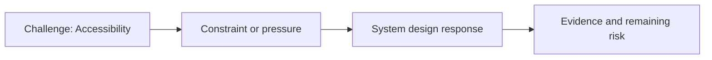

# Accessibility

@Metadata {
  @PageKind(article)
  @PageColor(gray)
  @PageImage(purpose: icon, source: "system-designs-google-maps-font-system-scaling-challenges-challenge.ios-app-nature.accessibility-icon.codex", alt: "Accessibility icon")
  @PageImage(purpose: card, source: "system-designs-google-maps-font-system-scaling-challenges-challenge.ios-app-nature.accessibility-card.codex", alt: "Accessibility card")
}

@Image(source: "system-designs-google-maps-font-system-scaling-challenges-challenge.ios-app-nature.accessibility-hero.codex", alt: "Accessibility hero")

This page records how the Google Maps typography system addressed "Accessibility".

## Challenge

We had to ensure text did not clip when accessibility sizing was applied.

## System design response

Accessibility testing ran as its own dedicated test phase.

## Evidence and remaining risk

We verified that text was not misread due to missing glyphs.
## Diagram: Context snapshot

@Image(source: "system-designs-google-maps-font-system-scaling-challenges-challenge.ios-app-nature.accessibility-context.mermaid", alt: "Context snapshot")

