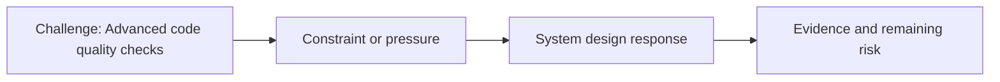

# Advanced code quality checks

@Metadata {
  @PageKind(article)
  @PageColor(gray)
  @PageImage(purpose: icon, source: "system-designs-google-maps-font-system-scaling-challenges-challenge.practice-and-maturity.advanced-code-quality-checks-icon.codex", alt: "Advanced code quality checks icon")
  @PageImage(purpose: card, source: "system-designs-google-maps-font-system-scaling-challenges-challenge.practice-and-maturity.advanced-code-quality-checks-card.codex", alt: "Advanced code quality checks card")
}

@Image(source: "system-designs-google-maps-font-system-scaling-challenges-challenge.practice-and-maturity.advanced-code-quality-checks-hero.codex", alt: "Advanced code quality checks hero")

This page records how the Google Maps typography system addressed "Advanced code quality checks".

## Challenge

We needed to simplify the API surface to improve quality checks.

## System design response

We reduced the API surface from ~40 references to 11 APIs.

## Evidence and remaining risk

We removed dependency on M1 libraries and deleted C-based APIs.
## Diagram: Context snapshot

@Image(source: "system-designs-google-maps-font-system-scaling-challenges-challenge.practice-and-maturity.advanced-code-quality-checks-context.mermaid", alt: "Context snapshot")

