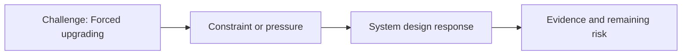

# Forced upgrading

@Metadata {
  @PageKind(article)
  @PageColor(gray)
  @PageImage(purpose: icon, source: "system-designs-google-maps-font-system-scaling-challenges-challenge.practice-and-maturity.forced-upgrading-icon.codex", alt: "Forced upgrading icon")
  @PageImage(purpose: card, source: "system-designs-google-maps-font-system-scaling-challenges-challenge.practice-and-maturity.forced-upgrading-card.codex", alt: "Forced upgrading card")
}

@Image(source: "system-designs-google-maps-font-system-scaling-challenges-challenge.practice-and-maturity.forced-upgrading-hero.codex", alt: "Forced upgrading hero")

This page records how the Google Maps typography system addressed "Forced upgrading".

## Challenge

## System design response

## Evidence and remaining risk

## Diagram: Context snapshot

@Image(source: "system-designs-google-maps-font-system-scaling-challenges-challenge.practice-and-maturity.forced-upgrading-context.mermaid", alt: "Context snapshot")

