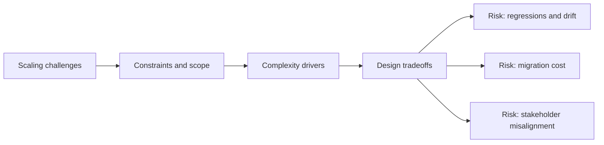

# Scaling Challenges

@Metadata {
  @PageKind(article)
  @PageColor(gray)
  @TitleHeading("Large Mobile Apps")
  @PageImage(purpose: icon, source: "ios-scaling-challenges-icon.codex", alt: "Scaling challenges Icon")
  @PageImage(purpose: card, source: "ios-scaling-challenges-card.codex", alt: "Scaling challenges Card")
}

@Options {
  @TopicsVisualStyle(detailedGrid)
  @AutomaticSeeAlso(disabled)
}

@Image(source: "ios-scaling-challenges-hero.codex", alt: "Scaling challenges Hero")

A map of the biggest challenges that surface when iOS apps and teams scale.

@Image(source: "index-hero.codex", alt: "Studio Laussat Hero")

## Diagram: Context Snapshot

@Image(source: "ios-scaling-challenges-context.mermaid", alt: "Context snapshot")

## Topics

- <doc:part-1-nature-of-ios-apps>
- <doc:part-2-app-complexity>
- <doc:part-3-large-ios-teams>
- <doc:part-4-cross-platform-ios-lens>
- <doc:part-5-stepping-up-your-game>

