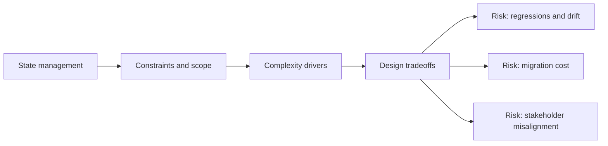

# State Management

@Metadata {
  @PageKind(article)
  @PageColor(gray)
  @TitleHeading("Large Mobile Apps")
  @PageImage(purpose: icon, source: "ios-scaling-challenges-01-state-management-icon.codex.svg", alt: "State management Icon")
  @PageImage(purpose: card, source: "ios-scaling-challenges-01-state-management-card.codex.svg", alt: "State management Card")
}

@Options {
  @AutomaticSeeAlso(disabled)
}

@Image(source: "ios-scaling-challenges-01-state-management-hero.codex.svg", alt: "State management Hero")

Large iOS apps juggle UIKit and SwiftUI lifecycles, async state, and multiple
stores of truth.

## Why it Gets Harder at Scale

- Multiple entry points fight over ownership of state and navigation.
- MainActor boundaries and reentrancy make subtle bugs hard to reproduce.

## Scale Signals

- UI desync between tabs, scenes, or deep link entry paths.
- Frequent "state reset" bugs after background or cold start.

## Laussat Studio Take

- Define a single state graph per feature and enforce ownership.

## Diagram: Context Snapshot

@Image(source: "ios-scaling-challenges-01-state-management-context.mermaid.svg", alt: "Context snapshot")

