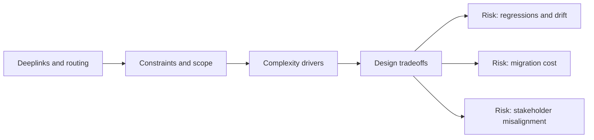

# Deeplinks and Routing

@Metadata {
  @PageKind(article)
  @PageColor(gray)
  @TitleHeading("Large Mobile Apps")
  @PageImage(purpose: icon, source: "ios-scaling-challenges-04-deeplinks-and-routing-icon.codex", alt: "Deeplinks and routing Icon")
  @PageImage(purpose: card, source: "ios-scaling-challenges-04-deeplinks-and-routing-card.codex", alt: "Deeplinks and routing Card")
}

@Options {
  @AutomaticSeeAlso(disabled)
}

@Image(source: "ios-scaling-challenges-04-deeplinks-and-routing-hero.codex", alt: "Deeplinks and routing Hero")

Universal Links, custom schemes, and scene lifecycles make deep links brittle at
scale.

## Why it Gets Harder at Scale

- Cold start and warm start flows diverge across scenes and tabs.
- Attribution and logging need to survive auth gates and delayed routing.

## Scale Signals

- Deep links work in some entry paths but fail in others.
- Attribution and routing metrics are missing or inconsistent.

## Laussat Studio Take

- Centralize routing and log every deep link decision path.

## Diagram: Context Snapshot

@Image(source: "ios-scaling-challenges-04-deeplinks-and-routing-context.mermaid", alt: "Context snapshot")

