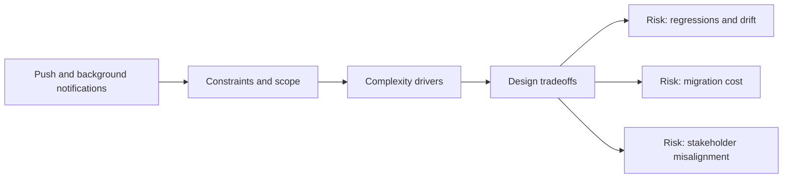

# Push and Background Notifications

@Metadata {
  @PageKind(article)
  @PageColor(gray)
  @TitleHeading("Large Mobile Apps")
  @PageImage(purpose: icon, source: "ios-scaling-challenges-05-push-and-background-notifications-icon.codex", alt: "Push and background notifications Icon")
  @PageImage(purpose: card, source: "ios-scaling-challenges-05-push-and-background-notifications-card.codex", alt: "Push and background notifications Card")
}

@Options {
  @AutomaticSeeAlso(disabled)
}

@Image(source: "ios-scaling-challenges-05-push-and-background-notifications-hero.codex", alt: "Push and background notifications Hero")

APNs delivery is best-effort, and background work is constrained by OS policy.

## Why it Gets Harder at Scale

- Silent pushes and background tasks are throttled unpredictably.
- Background URL sessions and refresh windows vary by device state.

## Scale Signals

- Background sync success rates fluctuate across cohorts.
- Users report missing updates despite correct server behavior.

## Laussat Studio Take

- Design idempotent background work with explicit retry queues.

## Diagram: Context Snapshot

@Image(source: "ios-scaling-challenges-05-push-and-background-notifications-context.mermaid", alt: "Context snapshot")

