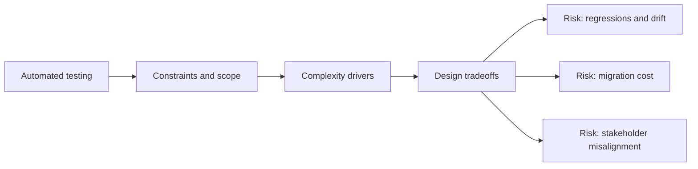

# Automated Testing

@Metadata {
  @PageKind(article)
  @PageColor(gray)
  @TitleHeading("Large Mobile Apps")
  @PageImage(purpose: icon, source: "ios-scaling-challenges-17-automated-testing-icon.codex", alt: "Automated testing Icon")
  @PageImage(purpose: card, source: "ios-scaling-challenges-17-automated-testing-card.codex", alt: "Automated testing Card")
}

@Options {
  @AutomaticSeeAlso(disabled)
}

@Image(source: "ios-scaling-challenges-17-automated-testing-hero.codex", alt: "Automated testing Hero")

iOS test stability is fragile under concurrency, UI timing, and data variance.

## Why it Gets Harder at Scale

- XCTest and XCUITest flake under slow devices and async workflows.
- SwiftUI testing coverage remains inconsistent across teams.

## Scale Signals

- Flake budgets increase and slow releases.
- Teams disable tests to unblock merges.

## Laussat Studio Take

- Use hermetic test data and enforce flake budgets.

## Diagram: Context Snapshot

@Image(source: "ios-scaling-challenges-17-automated-testing-context.mermaid", alt: "Context snapshot")

