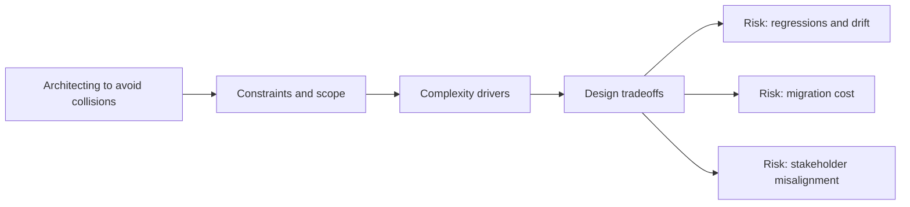

# Architecting to Avoid Collisions

@Metadata {
  @PageKind(article)
  @PageColor(gray)
  @TitleHeading("Large Mobile Apps")
  @PageImage(purpose: icon, source: "ios-scaling-challenges-20-architecting-to-avoid-collisions-icon.codex", alt: "Architecting to avoid collisions Icon")
  @PageImage(purpose: card, source: "ios-scaling-challenges-20-architecting-to-avoid-collisions-card.codex", alt: "Architecting to avoid collisions Card")
}

@Options {
  @AutomaticSeeAlso(disabled)
}

@Image(source: "ios-scaling-challenges-20-architecting-to-avoid-collisions-hero.codex", alt: "Architecting to avoid collisions Hero")

Large teams need boundaries to avoid multiple features colliding in one area.

## Why it Gets Harder at Scale

- Shared surfaces invite conflicting assumptions and dependencies.
- Global singletons hide ownership and create coupling.

## Scale Signals

- Multiple teams change the same flow in one release.
- Fixes for one feature break another team.

## Laussat Studio Take

- Establish code ownership and enforce dependency direction rules.

## Diagram: Context Snapshot

@Image(source: "ios-scaling-challenges-20-architecting-to-avoid-collisions-context.mermaid", alt: "Context snapshot")

