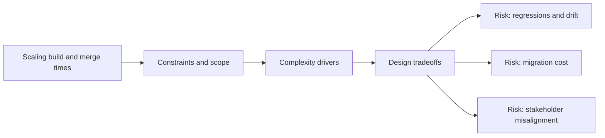

# Scaling Build and Merge Times

@Metadata {
  @PageKind(article)
  @PageColor(gray)
  @TitleHeading("Large Mobile Apps")
  @PageImage(purpose: icon, source: "ios-scaling-challenges-23-scaling-build-and-merge-times-icon.codex", alt: "Scaling build and merge times Icon")
  @PageImage(purpose: card, source: "ios-scaling-challenges-23-scaling-build-and-merge-times-card.codex", alt: "Scaling build and merge times Card")
}

@Options {
  @AutomaticSeeAlso(disabled)
}

@Image(source: "ios-scaling-challenges-23-scaling-build-and-merge-times-hero.codex", alt: "Scaling build and merge times Hero")

Swift build costs rise fast when module boundaries and interfaces drift.

## Why it Gets Harder at Scale

- Interface churn invalidates caches and slows incremental builds.
- Large test suites block merge velocity.

## Scale Signals

- CI queues grow while merge times increase.
- Local builds exceed acceptable iteration budgets.

## Laussat Studio Take

- Invest in module graph hygiene and cache-aware build tooling.

## Diagram: Context Snapshot

@Image(source: "ios-scaling-challenges-23-scaling-build-and-merge-times-context.mermaid", alt: "Context snapshot")

