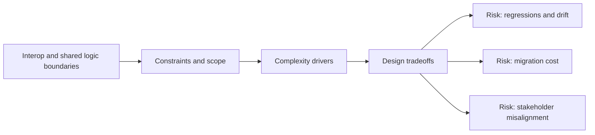

# Interop and Shared Logic Boundaries

@Metadata {
  @PageKind(article)
  @PageColor(gray)
  @TitleHeading("Large Mobile Apps")
  @PageImage(purpose: icon, source: "ios-scaling-challenges-26-interop-and-shared-logic-boundaries-icon.codex", alt: "Interop and shared logic boundaries Icon")
  @PageImage(purpose: card, source: "ios-scaling-challenges-26-interop-and-shared-logic-boundaries-card.codex", alt: "Interop and shared logic boundaries Card")
}

@Options {
  @AutomaticSeeAlso(disabled)
}

@Image(source: "ios-scaling-challenges-26-interop-and-shared-logic-boundaries-hero.codex", alt: "Interop and shared logic boundaries Hero")

iOS apps often interop with Objective-C, C, C++, or Rust for shared logic.

## Why it Gets Harder at Scale

- Bridging layers add ABI and build system complexity.
- Ownership and testing across language boundaries is harder to enforce.

## Scale Signals

- Build failures cluster around bridging headers or linker errors.
- Teams duplicate logic to avoid cross-language changes.

## Laussat Studio Take

- Keep bridges thin and isolate shared logic behind stable APIs.

## Diagram: Context Snapshot

@Image(source: "ios-scaling-challenges-26-interop-and-shared-logic-boundaries-context.mermaid", alt: "Context snapshot")

