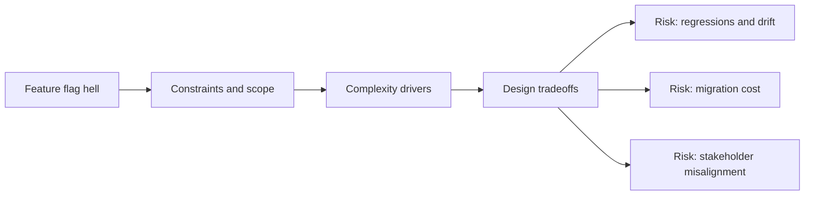

# Feature Flag Hell

@Metadata {
  @PageKind(article)
  @PageColor(gray)
  @TitleHeading("Large Mobile Apps")
  @PageImage(purpose: icon, source: "ios-scaling-challenges-31-feature-flag-hell-icon.codex", alt: "Feature flag hell Icon")
  @PageImage(purpose: card, source: "ios-scaling-challenges-31-feature-flag-hell-card.codex", alt: "Feature flag hell Card")
}

@Options {
  @AutomaticSeeAlso(disabled)
}

@Image(source: "ios-scaling-challenges-31-feature-flag-hell-hero.codex", alt: "Feature flag hell Hero")

Flags accumulate quickly and can harden into permanent complexity.

## Why it Gets Harder at Scale

- Flags create hidden branches that are rarely tested.
- Ownership and cleanup are unclear across teams.

## Scale Signals

- Dead flags linger past their intended window.
- Complex conditional logic spreads across modules.

## Laussat Studio Take

- Enforce flag lifetimes and audits each release.

## Diagram: Context Snapshot

@Image(source: "ios-scaling-challenges-31-feature-flag-hell-context.mermaid", alt: "Context snapshot")

