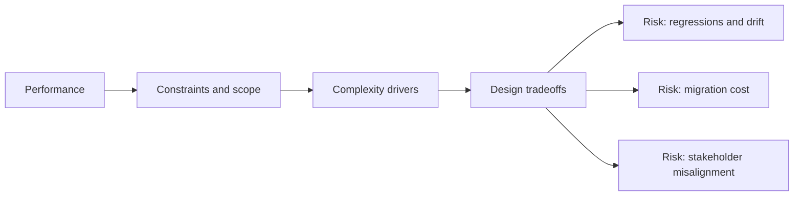

# Performance

@Metadata {
  @PageKind(article)
  @PageColor(gray)
  @TitleHeading("Large Mobile Apps")
  @PageImage(purpose: icon, source: "ios-scaling-challenges-32-performance-icon.codex", alt: "Performance Icon")
  @PageImage(purpose: card, source: "ios-scaling-challenges-32-performance-card.codex", alt: "Performance Card")
}

@Options {
  @AutomaticSeeAlso(disabled)
}

@Image(source: "ios-scaling-challenges-32-performance-hero.codex", alt: "Performance Hero")

Performance issues surface as cold starts, jank, and energy regressions.

## Why it Gets Harder at Scale

- Main-thread work grows with feature accumulation.
- Asset and networking costs stack across modules.

## Scale Signals

- Launch time and frame drops exceed performance budgets.
- Performance varies widely by device class.

## Laussat Studio Take

- Set explicit budgets and profile against them every release.

## Diagram: Context Snapshot

@Image(source: "ios-scaling-challenges-32-performance-context.mermaid", alt: "Context snapshot")

