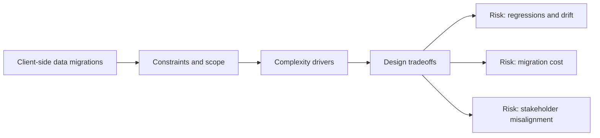

# Client-side Data Migrations

@Metadata {
  @PageKind(article)
  @PageColor(gray)
  @TitleHeading("Large Mobile Apps")
  @PageImage(purpose: icon, source: "ios-scaling-challenges-37-client-side-data-migrations-icon.codex.svg", alt: "Client-side data migrations Icon")
  @PageImage(purpose: card, source: "ios-scaling-challenges-37-client-side-data-migrations-card.codex.svg", alt: "Client-side data migrations Card")
}

@Options {
  @AutomaticSeeAlso(disabled)
}

@Image(source: "ios-scaling-challenges-37-client-side-data-migrations-hero.codex.svg", alt: "Client-side data migrations Hero")

Core Data and SQLite migrations require careful versioning and testing.

## Why it Gets Harder at Scale

- Schema drift across releases complicates migration paths.
- Large datasets make migrations slow or fragile.

## Scale Signals

- Upgrade crashes spike after migrations ship.
- Users report data loss or missing records.

## Laussat Studio Take

- Test migrations against historical snapshots and large data sets.

## Diagram: Context Snapshot

@Image(source: "ios-scaling-challenges-37-client-side-data-migrations-context.mermaid.svg", alt: "Context snapshot")

