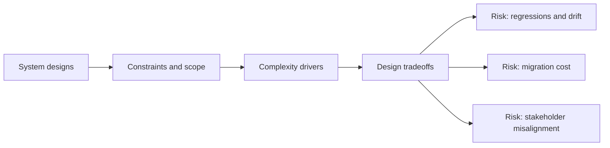

# Introduction

@Metadata {
  @PageKind(article)
  @PageColor(gray)
  @TitleHeading("Introduction")
  @PageImage(purpose: icon, source: "system-designs-icon.codex", alt: "System designs Icon")
  @PageImage(purpose: card, source: "system-designs-card.codex", alt: "System designs Card")
}

@Options {
  @TopicsVisualStyle(detailedGrid)
  @AutomaticSeeAlso(disabled)
}

@Image(source: "system-designs-hero.codex", alt: "System designs Hero")

This section includes real system designs from the past decade that I have done
for teams, covering systems that shipped in production and were refined under
real‑world constraints.

@Image(source: "index-hero.codex", alt: "Studio Laussat Hero")

## Diagram: Context Snapshot

@Image(source: "system-designs-context.mermaid", alt: "Context snapshot")

## Topics

### System Design Framework

- <doc:system-design-dimensions>

### Case Studies

- <doc:google-maps-typography-design-overview>
