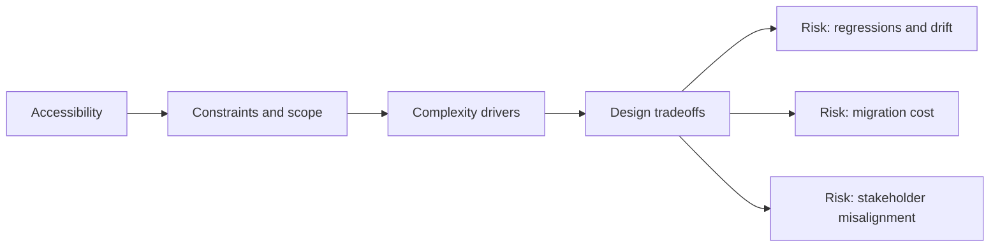

# Accessibility

@Metadata {
  @PageKind(article)
  @PageColor(gray)
  @TitleHeading("Large Mobile Apps")
  @PageImage(purpose: icon, source: "ios-scaling-challenges-08-accessibility-icon.codex", alt: "Accessibility Icon")
  @PageImage(purpose: card, source: "ios-scaling-challenges-08-accessibility-card.codex", alt: "Accessibility Card")
}

@Options {
  @AutomaticSeeAlso(disabled)
}

@Image(source: "ios-scaling-challenges-08-accessibility-hero.codex", alt: "Accessibility Hero")

Large apps regress accessibility as screens multiply and UI components diverge.

## Why it gets harder at scale

- VoiceOver order, labels, and Dynamic Type must be maintained across modules.
- Visual changes can break contrast or motion expectations quietly.

## Scale signals

- Accessibility audits uncover repeated label or focus defects.
- High Dynamic Type sizes break layout and truncation rules.

## Studio Laussat take

- Include accessibility checks in CI and in release checklists.

## Diagram: Context snapshot

@Image(source: "ios-scaling-challenges-08-accessibility-context.mermaid", alt: "Context snapshot")

