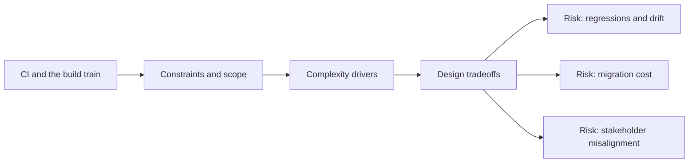

# CI and the build train

@Metadata {
  @PageKind(article)
  @PageColor(gray)
  @TitleHeading("Large Mobile Apps")
  @PageImage(purpose: icon, source: "ios-scaling-challenges-09-ci-cd-and-the-build-train-icon.codex", alt: "CI and the build train Icon")
  @PageImage(purpose: card, source: "ios-scaling-challenges-09-ci-cd-and-the-build-train-card.codex", alt: "CI and the build train Card")
}

@Options {
  @AutomaticSeeAlso(disabled)
}

@Image(source: "ios-scaling-challenges-09-ci-cd-and-the-build-train-hero.codex", alt: "CI and the build train Hero")

Code signing, provisioning, and Xcode tooling make mobile release pipelines more
fragile.

## Why it gets harder at scale

- Build reproducibility depends on exact toolchain and signing state.
- TestFlight and App Store gating introduce non-engineering delays.

## Scale signals

- CI pipelines fail on signing or provisioning drift.
- Release candidates stall due to slow validation cycles.

## Studio Laussat take

- Automate signing and document promotion rules for each train.

## Diagram: Context snapshot

@Image(source: "ios-scaling-challenges-09-ci-cd-and-the-build-train-context.mermaid", alt: "Context snapshot")

