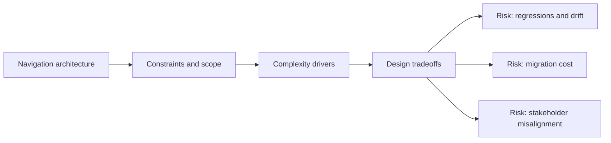

# Navigation Architecture

@Metadata {
  @PageKind(article)
  @PageColor(gray)
  @TitleHeading("Large Mobile Apps")
  @PageImage(purpose: icon, source: "ios-scaling-challenges-13-navigation-architecture-icon.codex", alt: "Navigation architecture Icon")
  @PageImage(purpose: card, source: "ios-scaling-challenges-13-navigation-architecture-card.codex", alt: "Navigation architecture Card")
}

@Options {
  @AutomaticSeeAlso(disabled)
}

@Image(source: "ios-scaling-challenges-13-navigation-architecture-hero.codex", alt: "Navigation architecture Hero")

Large apps combine stacks, tabs, and split views that must remain consistent
under deep link entry.

## Why It Gets Harder at Scale

- Multiple navigation systems compete across UIKit and SwiftUI.
- Scene-based routing makes cold start logic complex.

## Scale Signals

- Back navigation differs across surfaces.
- Deep links land in inconsistent routes or missing tabs.

## Laussat Studio Take

- Maintain a single route registry with clear ownership rules.

## Diagram: Context Snapshot

@Image(source: "ios-scaling-challenges-13-navigation-architecture-context.mermaid", alt: "Context snapshot")

