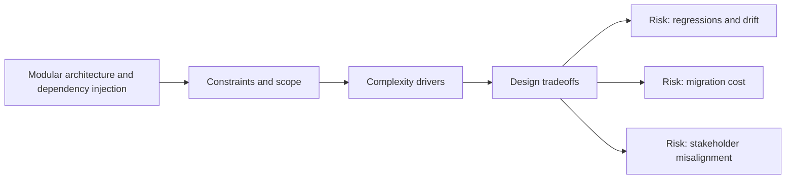

# Modular architecture and dependency injection

@Metadata {
  @PageKind(article)
  @PageColor(gray)
  @TitleHeading("Large Mobile Apps")
  @PageImage(purpose: icon, source: "ios-scaling-challenges-16-modular-architecture-and-dependency-injection-icon.codex", alt: "Modular architecture and dependency injection Icon")
  @PageImage(purpose: card, source: "ios-scaling-challenges-16-modular-architecture-and-dependency-injection-card.codex", alt: "Modular architecture and dependency injection Card")
}

@Options {
  @AutomaticSeeAlso(disabled)
}

@Image(source: "ios-scaling-challenges-16-modular-architecture-and-dependency-injection-hero.codex", alt: "Modular architecture and dependency injection Hero")

Modularization helps scale, but only if boundaries align with product domains.

## Why it gets harder at scale

- Module graphs drift without ownership and API contracts.
- DI systems can become global service locators.

## Scale signals

- Circular dependencies and forbidden imports creep in.
- Build times rise despite more modules.

## Studio Laussat take

- Define composition roots per feature and enforce API surface contracts.

## Diagram: Context snapshot

@Image(source: "ios-scaling-challenges-16-modular-architecture-and-dependency-injection-context.mermaid", alt: "Context snapshot")

