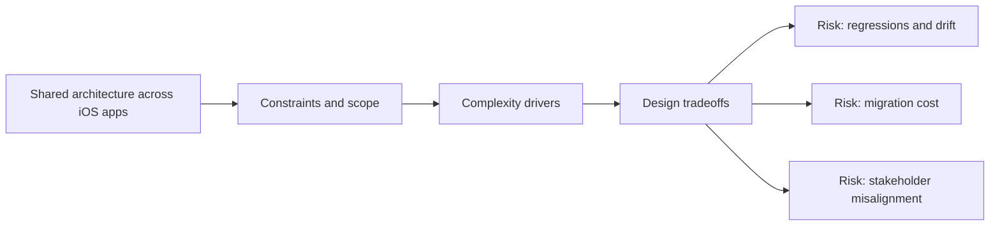

# Shared Architecture Across iOS Apps

@Metadata {
  @PageKind(article)
  @PageColor(gray)
  @TitleHeading("Large Mobile Apps")
  @PageImage(purpose: icon, source: "ios-scaling-challenges-21-shared-architecture-across-ios-apps-icon.codex", alt: "Shared architecture across iOS apps Icon")
  @PageImage(purpose: card, source: "ios-scaling-challenges-21-shared-architecture-across-ios-apps-card.codex", alt: "Shared architecture across iOS apps Card")
}

@Options {
  @AutomaticSeeAlso(disabled)
}

@Image(source: "ios-scaling-challenges-21-shared-architecture-across-ios-apps-hero.codex", alt: "Shared architecture across iOS apps Hero")

Shared SDKs and design systems can scale a portfolio, but only with careful
versioning.

## Why It Gets Harder at Scale

- Internal SDKs must support multiple release cadences.
- Migration tooling is required to avoid breaking dependent apps.

## Scale Signals

- Shared libraries block releases due to incompatible changes.
- Teams fork shared modules to avoid upgrades.

## Laussat Studio Take

- Use semantic versioning and adapters for backward compatibility.

## Diagram: Context Snapshot

@Image(source: "ios-scaling-challenges-21-shared-architecture-across-ios-apps-context.mermaid", alt: "Context snapshot")

