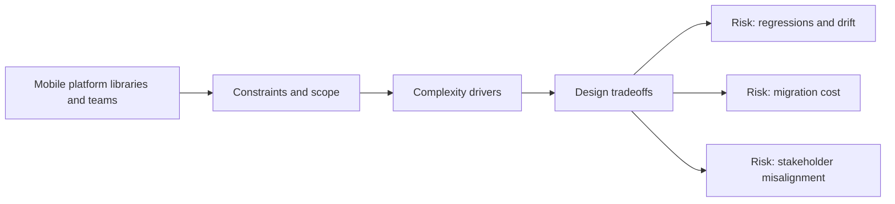

# Mobile Platform Libraries and Teams

@Metadata {
  @PageKind(article)
  @PageColor(gray)
  @TitleHeading("Large Mobile Apps")
  @PageImage(purpose: icon, source: "ios-scaling-challenges-24-mobile-platform-libraries-and-teams-icon.codex", alt: "Mobile platform libraries and teams Icon")
  @PageImage(purpose: card, source: "ios-scaling-challenges-24-mobile-platform-libraries-and-teams-card.codex", alt: "Mobile platform libraries and teams Card")
}

@Options {
  @AutomaticSeeAlso(disabled)
}

@Image(source: "ios-scaling-challenges-24-mobile-platform-libraries-and-teams-hero.codex", alt: "Mobile platform libraries and teams Hero")

A platform team provides shared foundations and guardrails for product teams.

## Why It Gets Harder at Scale

- Without shared ownership, teams reinvent core features.
- Platform changes lack adoption playbooks.

## Scale Signals

- Multiple authentication or networking stacks coexist.
- Upgrades stall due to unclear ownership.

## Laussat Studio Take

- Define a platform roadmap with adoption and deprecation plans.

## Diagram: Context Snapshot

@Image(source: "ios-scaling-challenges-24-mobile-platform-libraries-and-teams-context.mermaid", alt: "Context snapshot")

