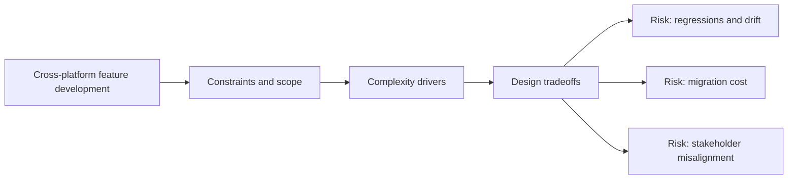

# Cross-platform feature development

@Metadata {
  @PageKind(article)
  @PageColor(gray)
  @TitleHeading("Large Mobile Apps")
  @PageImage(purpose: icon, source: "ios-scaling-challenges-27-cross-platform-feature-development-icon.codex", alt: "Cross-platform feature development Icon")
  @PageImage(purpose: card, source: "ios-scaling-challenges-27-cross-platform-feature-development-card.codex", alt: "Cross-platform feature development Card")
}

@Options {
  @AutomaticSeeAlso(disabled)
}

@Image(source: "ios-scaling-challenges-27-cross-platform-feature-development-hero.codex", alt: "Cross-platform feature development Hero")

Feature parity across platforms requires shared contracts without shared UI.

## Why it gets harder at scale

- Inconsistent server models lead to divergent client behavior.
- Testing parity requires shared fixtures and specs.

## Scale signals

- iOS behavior drifts from web or Android experiences.
- API changes break one platform at a time.

## Studio Laussat take

- Use shared schemas and contract tests to keep parity.

## Diagram: Context snapshot

@Image(source: "ios-scaling-challenges-27-cross-platform-feature-development-context.mermaid", alt: "Context snapshot")

