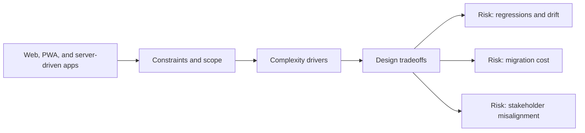

# Web, PWA, and server-driven apps

@Metadata {
  @PageKind(article)
  @PageColor(gray)
  @TitleHeading("Large Mobile Apps")
  @PageImage(purpose: icon, source: "ios-scaling-challenges-29-web-pwa-and-server-driven-apps-icon.codex", alt: "Web, PWA, and server-driven apps Icon")
  @PageImage(purpose: card, source: "ios-scaling-challenges-29-web-pwa-and-server-driven-apps-card.codex", alt: "Web, PWA, and server-driven apps Card")
}

@Options {
  @AutomaticSeeAlso(disabled)
}

@Image(source: "ios-scaling-challenges-29-web-pwa-and-server-driven-apps-hero.codex", alt: "Web, PWA, and server-driven apps Hero")

WKWebView and server-driven UI introduce new constraints for navigation, auth,
and accessibility.

## Why it gets harder at scale

- App and web navigation must stay in sync.
- Latency and caching behavior drive user perception.

## Scale signals

- Users get stuck between web and native routes.
- Accessibility parity breaks between native and web views.

## Studio Laussat take

- Define explicit app-web contracts for navigation and state.

## Diagram: Context snapshot

@Image(source: "ios-scaling-challenges-29-web-pwa-and-server-driven-apps-context.mermaid", alt: "Context snapshot")

