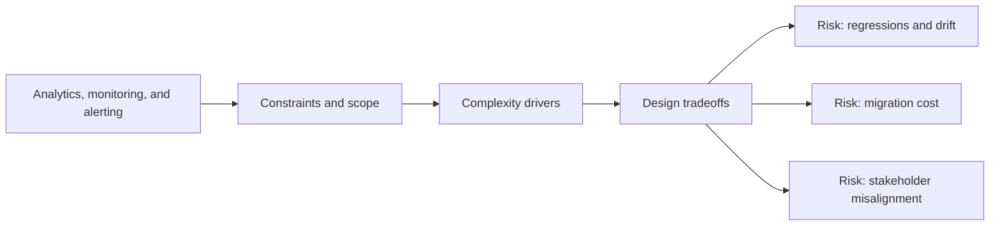

# Analytics, monitoring, and alerting

@Metadata {
  @PageKind(article)
  @PageColor(gray)
  @TitleHeading("Large Mobile Apps")
  @PageImage(purpose: icon, source: "ios-scaling-challenges-33-analytics-monitoring-and-alerting-icon.codex", alt: "Analytics, monitoring, and alerting Icon")
  @PageImage(purpose: card, source: "ios-scaling-challenges-33-analytics-monitoring-and-alerting-card.codex", alt: "Analytics, monitoring, and alerting Card")
}

@Options {
  @AutomaticSeeAlso(disabled)
}

@Image(source: "ios-scaling-challenges-33-analytics-monitoring-and-alerting-hero.codex", alt: "Analytics, monitoring, and alerting Hero")

Mobile observability needs client metrics, crash rates, and SLOs.

## Why it gets harder at scale

- Metrics differ across cohorts and app versions.
- Signal loss happens when logging is inconsistent.

## Scale signals

- No clear crash-free, launch time, or network error budgets.
- Oncall lacks actionable client telemetry.

## Studio Laussat take

- Standardize metrics and alerting for each release.

## Diagram: Context snapshot

@Image(source: "ios-scaling-challenges-33-analytics-monitoring-and-alerting-context.mermaid", alt: "Context snapshot")

