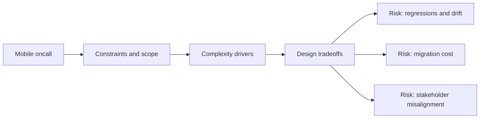

# Mobile Oncall

@Metadata {
  @PageKind(article)
  @PageColor(gray)
  @TitleHeading("Large Mobile Apps")
  @PageImage(purpose: icon, source: "ios-scaling-challenges-34-mobile-oncall-icon.codex", alt: "Mobile oncall Icon")
  @PageImage(purpose: card, source: "ios-scaling-challenges-34-mobile-oncall-card.codex", alt: "Mobile oncall Card")
}

@Options {
  @AutomaticSeeAlso(disabled)
}

@Image(source: "ios-scaling-challenges-34-mobile-oncall-hero.codex", alt: "Mobile oncall Hero")

Mobile incidents require quick triage, rollback paths, and server gating.

## Why It Gets Harder at Scale

- Rollout timelines and App Store delays slow mitigation.
- Cross-platform coordination complicates incident response.

## Scale Signals

- Oncall lacks clear runbooks for client regressions.
- Incidents repeat without postmortem follow-through.

## Laussat Studio Take

- Maintain incident playbooks and rehearsal drills.

## Diagram: Context Snapshot

@Image(source: "ios-scaling-challenges-34-mobile-oncall-context.mermaid", alt: "Context snapshot")

