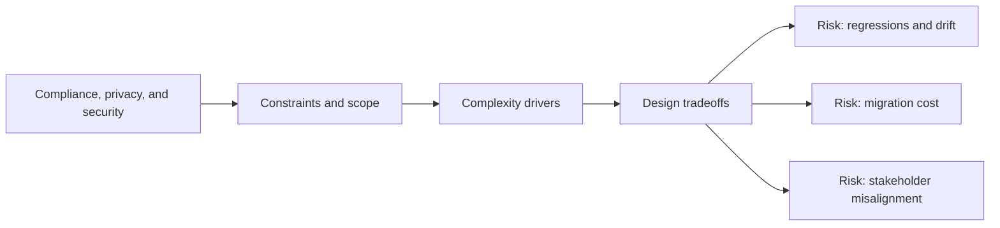

# Compliance, Privacy, and Security

@Metadata {
  @PageKind(article)
  @PageColor(gray)
  @TitleHeading("Large Mobile Apps")
  @PageImage(purpose: icon, source: "ios-scaling-challenges-36-compliance-privacy-and-security-icon.codex", alt: "Compliance, privacy, and security Icon")
  @PageImage(purpose: card, source: "ios-scaling-challenges-36-compliance-privacy-and-security-card.codex", alt: "Compliance, privacy, and security Card")
}

@Options {
  @AutomaticSeeAlso(disabled)
}

@Image(source: "ios-scaling-challenges-36-compliance-privacy-and-security-hero.codex", alt: "Compliance, privacy, and security Hero")

Privacy manifests, ATT, and secure storage require disciplined governance.

## Why It Gets Harder at Scale

- Data flows shift faster than privacy disclosures are updated.
- Platform policies change annually, forcing urgent updates.

## Scale Signals

- App Store review rejections for privacy or tracking.
- Logging includes sensitive data unintentionally.

## Laussat Studio Take

- Include privacy review gates in release workflows.

## Diagram: Context Snapshot

@Image(source: "ios-scaling-challenges-36-compliance-privacy-and-security-context.mermaid", alt: "Context snapshot")

