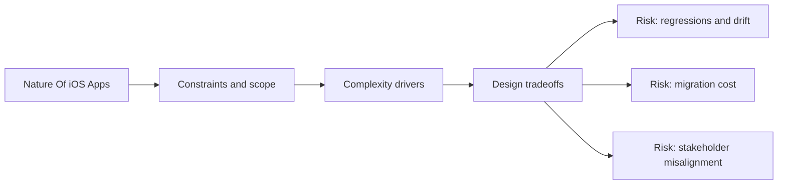

# Nature Of iOS Apps

@Metadata {
  @PageKind(article)
  @PageColor(gray)
  @TitleHeading("Nature Of iOS Apps")
  @PageImage(purpose: icon, source: "ios-scaling-challenges-part-1-nature-of-ios-apps-icon.codex", alt: "Nature of iOS apps icon")
  @PageImage(purpose: card, source: "ios-scaling-challenges-part-1-nature-of-ios-apps-card.codex", alt: "Nature of iOS apps card")
}

@Options {
  @TopicsVisualStyle(detailedGrid)
  @AutomaticSeeAlso(disabled)
}

@Image(source: "ios-scaling-challenges-part-1-nature-of-ios-apps-hero.codex", alt: "Nature of iOS apps hero")

The constraints of Apple platforms shape every architectural decision, from
state to distribution.

## Topics

- <doc:01-state-management>
- <doc:02-mistakes-are-hard-to-revert>
- <doc:03-long-tail-of-old-app-versions>
- <doc:04-deeplinks-and-routing>
- <doc:05-push-and-background-notifications>
- <doc:06-app-crashes>
- <doc:07-offline-support>
- <doc:08-accessibility>
- <doc:09-ci-cd-and-the-build-train>
- <doc:10-third-party-libraries-and-sdks>
- <doc:11-device-and-os-fragmentation>
- <doc:12-in-app-purchases>

## Diagram: Context snapshot

@Image(source: "ios-scaling-challenges-part-1-nature-of-ios-apps-context.mermaid", alt: "Context snapshot")

