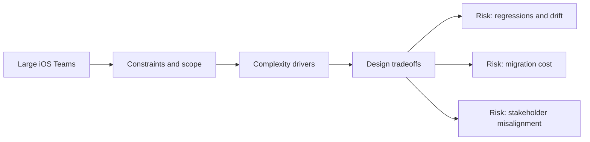

# Large iOS Teams

@Metadata {
  @PageKind(article)
  @PageColor(gray)
  @TitleHeading("Large iOS Teams")
  @PageImage(purpose: icon, source: "ios-scaling-challenges-part-3-large-ios-teams-icon.codex", alt: "Large iOS teams icon")
  @PageImage(purpose: card, source: "ios-scaling-challenges-part-3-large-ios-teams-card.codex", alt: "Large iOS teams card")
}

@Options {
  @TopicsVisualStyle(detailedGrid)
  @AutomaticSeeAlso(disabled)
}

@Image(source: "ios-scaling-challenges-part-3-large-ios-teams-hero.codex", alt: "Large iOS teams hero")

Scale is a coordination problem: ownership, tooling, and shared platforms.

## Diagram: Context snapshot

@Image(source: "ios-scaling-challenges-part-3-large-ios-teams-context.mermaid", alt: "Context snapshot")

## Topics

- <doc:19-planning-and-decision-making>
- <doc:20-architecting-to-avoid-collisions>
- <doc:21-shared-architecture-across-ios-apps>
- <doc:22-tooling-maturity-for-large-ios-teams>
- <doc:23-scaling-build-and-merge-times>
- <doc:24-mobile-platform-libraries-and-teams>

